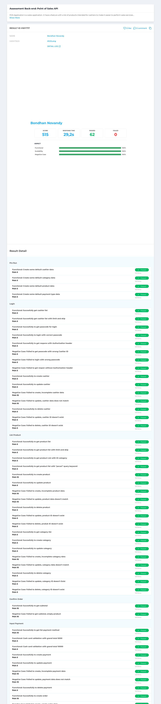

# ecommerce

A simple E2E ecommerce REST api. For GOTOKO take home test.  Author: bondhan.novandy@gmail.com

## build & run
```bash
make
```

## migration
### create migration

```bash
migrate create -ext sql -dir migrations/scripts/ -seq -digits 2 create_table_order_details
```

### migrate up

```bash
migrate -database mysql://root@/ecommerce -path ./migrations/scripts up
```

### migrate down

```bash
migrate -database mysql://root@/ecommerce -path ./migrations/scripts down
```

### run docker

mac:
```bash
docker run -e API_URL=http://host.docker.internal:3030 -e "MYSQL_HOST=localhost" -e "MYSQL_PORT=3306" -e "MYSQL_USER=root" -e "MYSQL_DBNAME=ecommerce" -p 8080:3030 ecommerce:v1
```

```bash
 docker run -e "MYSQL_HOST=host.docker.internal" -e "MYSQL_PORT=3306" -e "MYSQL_USER=root" -e "MYSQL_DBNAME=ecommerce" -p 8080:3030 ecommerce:v1
```

linux:

```bash
docker build --platform linux/amd64  --no-cache -t bono02/ecommerce:v1-linux -f ./Dockerfile .
```

interactive:

```bash
docker run --rm -ti -e "MYSQL_HOST=host.docker.internal" -e "MYSQL_PORT=3306" -e "MYSQL_USER=root" -e "MYSQL_DBNAME=ecommerce" -p 8080:3030 ecommerce:v1 /bin/bash
```

push:

```bash
docker build --platform linux/amd64  --no-cache -t bono02/ecommerce:v1-linux -f ./Dockerfile .  &&  docker push bono02/ecommerce:v1-linux
```

## Result
[HWY717](https://devcode.gethired.id/job/HWY717)

<a href="/docs/screenshots/devcode-gethired-id-job-HWY717.jpg">
